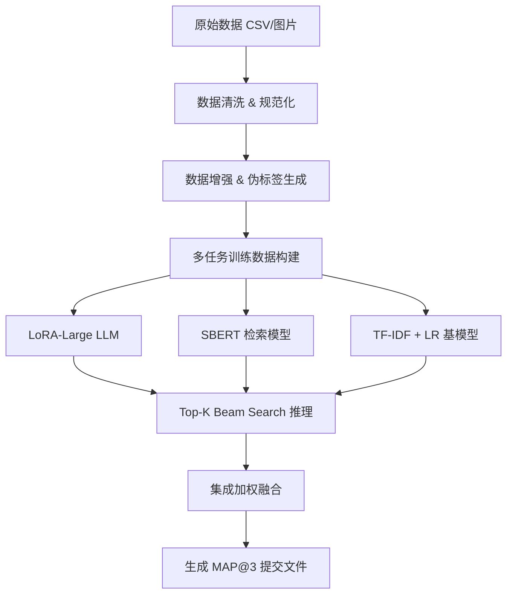

# 学生数学误解检测高分方案设计文档

## 1. 项目目标
在 Kaggle **MAP: Charting Student Math Misunderstandings** 竞赛或类似教育场景下，构建一个高精度模型，用于：
- 检测学生作答是否正确/错误
- 判断是否存在误解并分类具体误解类型
- 提升 MAP@3 分数，目标 >0.80

---

## 2. 模型架构概览

整体架构采用 **多阶段 + 多模型集成** 策略，包括数据预处理、特征增强、LoRA 微调 LLM、检索增强、集成推理。

---

## 3. 数据增强策略

### 3.1 数据清洗
- 统一数学表达式格式（`1/2 ÷ 6` → `0.5 / 6`）
- 清理拼写错误、HTML标签、重复字符
- 为公式补充自然语言描述（帮助模型理解）

### 3.2 数据增强
- **释义增强（Paraphrase）**：用大模型改写学生解释
- **反事实增强（Counterfactual）**：将错误答案改为正确解释，丰富负样本
- **负样本扩充**：构造典型误解场景，增加鲁棒性

### 3.3 伪标签（Pseudo-labeling）
- 使用当前模型预测测试集，筛选高置信度样本加入训练
- 实现半监督学习，提高泛化能力

### 3.4 外部数据迁移
- 引入 Eedi、ASSISTments、EdNet 等教育数据
- 可先进行多任务预训练或 LoRA 预热

---

## 4. 模型设计与训练计划

### 4.1 模型选择
- 基础模型：`gemma-7b` / `LLaMA-3-8B` / `Mistral-7B`
- 参数高效微调：LoRA + QLoRA（r=64, alpha=32）
- 辅助模型：SBERT 检索 + TF-IDF LR 轻量模型

### 4.2 多任务训练
1. 正确性分类（Correct / Incorrect）
2. 误解检测（Misconception / Neither）
3. 误解类型预测（多标签或 Top-K 排序）

### 4.3 损失函数与优化
- 多标签 BCE + Focal Loss（解决类别不平衡）
- 对比学习（Contrastive Loss）拉近相似误解样本
- 学习率调度：Cosine / Warmup Scheduler

### 4.4 训练流程
- 数据清洗 + 增强 → 构建多任务指令数据集
- LoRA 微调大模型（batch size 32, epoch 3~5）
- K-fold 训练 5-10 个 LoRA 模型
- WandB 实时监控 loss 与精度

---

## 5. 推理与集成策略

### 5.1 推理优化
- 使用 **beam search** 或 **nucleus sampling** 生成 Top-3 候选
- 输出概率归一化，按置信度排序

### 5.2 多模型集成
- 融合三类模型输出：
  - LoRA LLM（语义理解强）
  - SBERT + XGBoost 检索分类器（结构化检索）
  - TF-IDF + LR（传统基线，防止过拟合）
- 最终集成方式：logits 加权平均

### 5.3 提交文件生成
- 将模型输出格式化为 `Category:Misconception`，最多 3 条
- 对接 Kaggle MAP@3 评估

---

## 6. 迭代路线建议

1. **阶段1：数据与基线**
   - 完成数据清洗与基础 TF-IDF + LR
   - 跑通 baseline，生成有效提交

2. **阶段2：单模型提升**
   - 训练 LoRA LLM
   - 引入数据增强与伪标签

3. **阶段3：多模型融合**
   - 加入 SBERT 检索 + 传统模型
   - 实现集成推理与 Top-K 输出

4. **阶段4：进阶优化**
   - 尝试多模态输入（题图 + 文本）
   - 对比学习与蒸馏策略

---

## 7. 目标指标

- 公开榜 MAP@3 ≥ 0.80
- 本地验证与私榜一致性提高
- 具备多任务泛化能力，可拓展到其他教育误解检测任务

---

📌 **总结**：该方案通过数据增强、LoRA 大模型微调、多任务训练、检索增强及多模型集成的方式，系统性提升学生数学误解检测任务的准确率与鲁棒性，适合用于 Kaggle 高分冲榜或教育 AI 产品落地。

